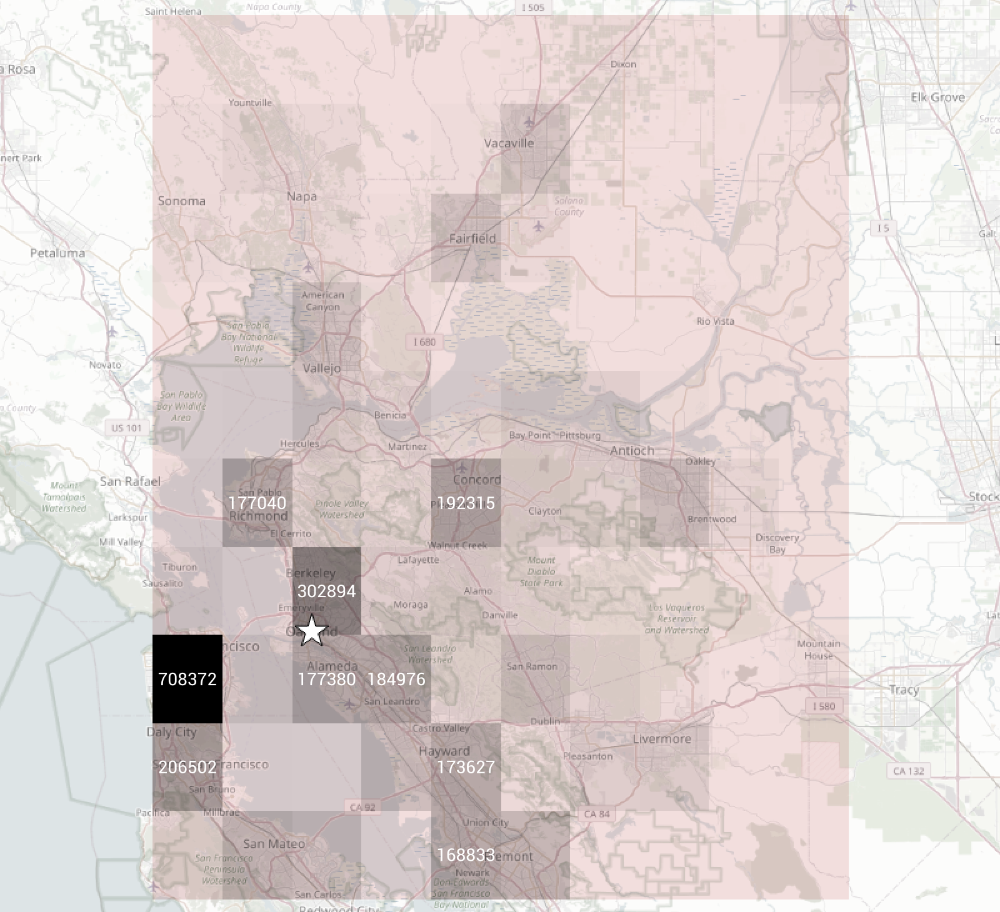
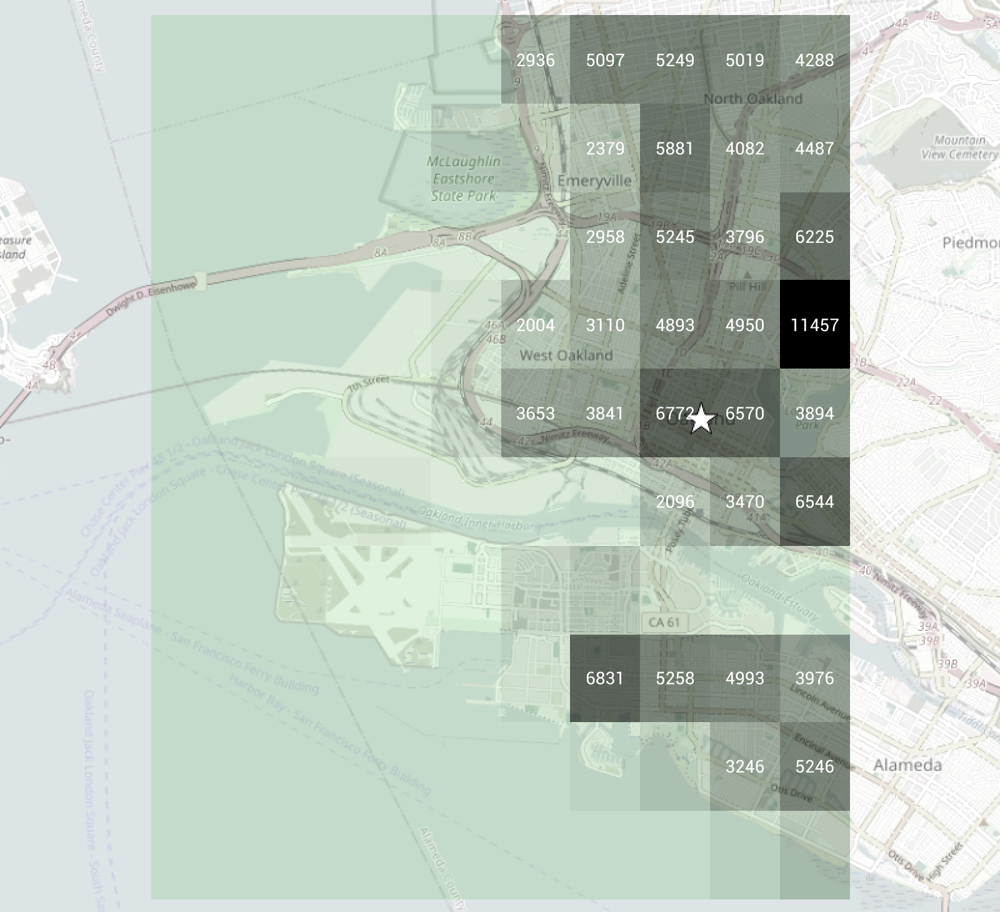
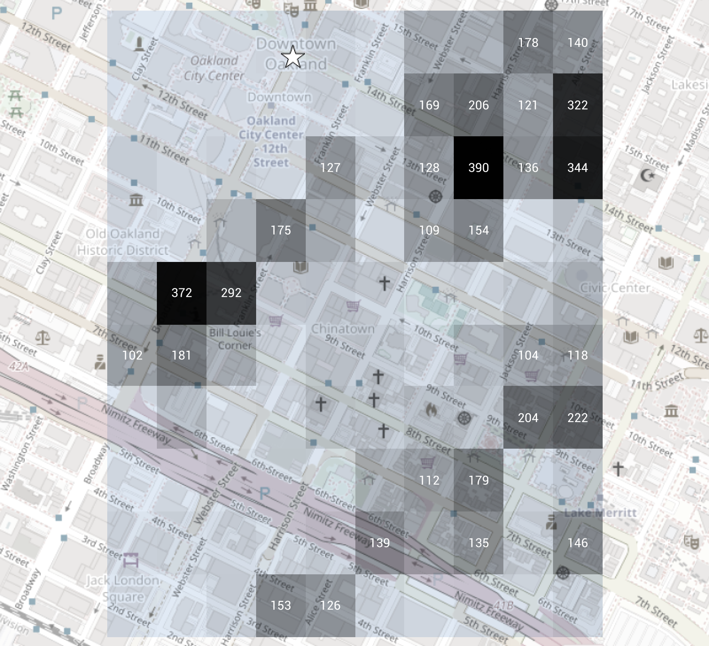

[API Docs](openapi.yaml)

## Interaction

Let’s say you’re at -122.27119° Longitude, 37.80432° Latitude, the intersection of
[14th & Broadway in Downtown Oakland](https://www.openstreetmap.org/node/10139029526).

### Zero Decimal Degrees or 100km Precision

That rounds to (-122, 38), so your first request is for
[https://atgeo-experiment.teczno.com/?lon=-122&lat=38](https://atgeo-experiment.teczno.com/?lon=-122&lat=38),
with this response:

```JSON
{
    "ulx": -122.5,
    "uly": 38.5,
    "dx": 0.1,
    "dy": -0.1,
    "total": 4535260,
    "data": [ …, [ 45967.3, 45967.3, 302894, … ], … ]
}
```

Using whole number degrees in this area could identify you as one of 4.5 million
people in the densely populated northern Bay Area. Inside the matrix of sub-areas, the
one with your real downtown Oakland location has almost 303K people, a comfortably large
number as well. It’s safe to look deeper.

<a href="https://www.openstreetmap.org/#map=10/37.80432/-122.27119"></a>

### One Decimal Degree or 10km Precision

You add a degree of precision to get (-122.3, 37.8) and make your second request for
[https://atgeo-experiment.teczno.com/?lon=-122.3&lat=37.8](https://atgeo-experiment.teczno.com/?lon=-122.3&lat=37.8),
with this response:

```JSON
{
    "ulx": -122.35,
    "uly": 38.85,
    "dx": 0.01,
    "dy": -0.01,
    "total": 164311,
    "data": [ …, [ …, 6771.7, 6570, 3894.2 ], … ]
}
```

The total here is 164K, different from the earlier 303K because this area is aligned a
little to the west between (-122.35, 37.75) and (-122.25, 37.85). Your real downtown
Oakland location is in one of the more heavily populated sub-areas with 6.8K people,
which also seems comfortably large. It’s safe to look deeper again.

<a href="https://www.openstreetmap.org/#map=13/37.80432/-122.27119"></a>

### Two Decimal Degrees or 1km Precision

You add a degree of precision including a significant zero to get (-122.27, 37.80) and make your third request for
[https://atgeo-experiment.teczno.com/?lon=-122.27&lat=37.80](https://atgeo-experiment.teczno.com/?lon=-122.27&lat=37.80),
with this response:

```JSON
{
    "ulx": -122.275,
    "uly": 37.805,
    "dx": 0.001,
    "dy": -0.001,
    "total": 7198.8,
    "data": [ [ null, null, null, 5.3, … ], … ]
}
```

The total here is 7.2K for an area between (-122.275, 37.795) and (-122.265, 37.805).
Your real downtown location now has just 5 people in it, and the densest areas here have
just a few hundred. Each sub-area is just 100m long from North to South and we’re
reaching the limits of HRSL precision. You’re not comfortable geolocating yourself any
further than two degrees of decimal precision because it gives away too much detail so
you stop.

<a href="https://www.openstreetmap.org/#map=16/37.80432/-122.27119"></a>

## Geohash Drill-Down with `/dgg`

The `/dgg` endpoint accepts a geohash string (1–7 characters) and returns the 32 next-level
sub-areas corresponding to each character in the geohash base-32 alphabet.

Let's use the same location, 14th & Broadway in Downtown Oakland, whose geohash is `9q9p1dhf4u08v5`.

### One-Character Geohash (~1000km)

`9` covers most of North America west of the Mississippi. Request
[/dgg?geohash=9](https://atgeo-experiment.teczno.com/dgg?geohash=9) to see all 32 two-character children:

```JSON
{
    "geohash": "9",
    "ulx": -135.0,
    "uly": 45.0,
    "dx": 11.25,
    "dy": -5.625,
    "total": 266698940.7,
    "sub-areas": {
        "9q": {"link": "/dgg?geohash=9q", "count": 35974940.0},
        "9h": {"link": "/dgg?geohash=9h", "count": 8267192.0},
        …
    }
}
```

Using a single geohash character you can identify yourself as one of 267 million people in
western North America. The sub-area containing Oakland, `9q`, has 36 million people in it —
a comfortably large anonymity set. It's safe to look deeper.

### Two-Character Geohash (~300km)

`9q` covers California and Nevada. Request [/dgg?geohash=9q](https://atgeo-experiment.teczno.com/dgg?geohash=9q):

```JSON
{
    "geohash": "9q",
    "ulx": -123.75,
    "uly": 39.375,
    "dx": 1.40625,
    "dy": -1.40625,
    "total": 36381211.3,
    "sub-areas": {
        "9q9": {"link": "/dgg?geohash=9q9", "count": 5601428.5},
        "9qh": {"link": "/dgg?geohash=9qh", "count": 8267192.0},
        …
    }
}
```

The Bay Area falls in `9q9` with 5.6 million people. Still a large set. Look deeper.

### Three-Character Geohash (~150km)

`9q9` covers the San Francisco Bay Area. Request [/dgg?geohash=9q9](https://atgeo-experiment.teczno.com/dgg?geohash=9q9):

```JSON
{
    "geohash": "9q9",
    "ulx": -122.34375,
    "uly": 37.96875,
    "dx": 0.3515625,
    "dy": -0.17578125,
    "total": 5762927.5,
    "sub-areas": {
        "9q9p": {"link": "/dgg?geohash=9q9p", "count": 718015.1},
        "9q9k": {"link": "/dgg?geohash=9q9k", "count": 956026.2},
        …
    }
}
```

Oakland is in `9q9p` with 718K people. Still comfortable. Keep going.

### Four-Character Geohash (~40km)

`9q9p` covers the East Bay. Request [/dgg?geohash=9q9p](https://atgeo-experiment.teczno.com/dgg?geohash=9q9p):

```JSON
{
    "geohash": "9q9p",
    "ulx": -122.34375,
    "uly": 37.96875,
    "dx": 0.0439453125,
    "dy": -0.0439453125,
    "total": 718014.9,
    "sub-areas": {
        "9q9p1": {"link": "/dgg?geohash=9q9p1", "count": 70902.1},
        "9q9p3": {"link": "/dgg?geohash=9q9p3", "count": 95934.0},
        …
    }
}
```

Downtown Oakland is in `9q9p1` with 71K people. Getting smaller but still reasonable.

### Five-Character Geohash (~5km)

`9q9p1` covers central Oakland and the waterfront. Request [/dgg?geohash=9q9p1](https://atgeo-experiment.teczno.com/dgg?geohash=9q9p1):

```JSON
{
    "geohash": "9q9p1",
    "ulx": -122.2998046875,
    "uly": 37.8369140625,
    "dx": 0.010986328125,
    "dy": -0.0054931640625,
    "total": 71918.8,
    "sub-areas": {
        "9q9p1d": {"link": "/dgg?geohash=9q9p1d", "count": 2936.7},
        …
    }
}
```

The sub-area containing 14th & Broadway is `9q9p1d` with 2,937 people — now you're down to
a neighbourhood. The cells here are about 1km across.

### Six-Character Geohash (~1km)

`9q9p1d` covers Downtown Oakland around 14th Street. Request [/dgg?geohash=9q9p1d](https://atgeo-experiment.teczno.com/dgg?geohash=9q9p1d):

```JSON
{
    "geohash": "9q9p1d",
    "ulx": -122.27783203125,
    "uly": 37.8094482421875,
    "dx": 0.001373291015625,
    "dy": -0.001373291015625,
    "total": 2936.7,
    "sub-areas": {
        "9q9p1dh": {"link": "/dgg?geohash=9q9p1dh", "count": 6.2},
        …
    }
}
```

The cell for 14th & Broadway is `9q9p1dh` with just 6 people. Each cell is now about 150m
across and we're at the limit of HRSL precision. You stop here.

## Quadkey Drill-Down with `/dgg`

The `/dgg` endpoint also accepts a `quadkey` query parameter (1–18 characters using
digits 0–3). Unlike geohash which has 32 children per level, quadkey is base-4 — each
additional character adds only 4 sub-areas. To make drill-down practical, each response
spans **up to 3 levels ahead**, returning all intermediate sub-areas. Coordinates in the
response are in EPSG:3857 (Web Mercator meters).

The same location, 14th & Broadway in Downtown Oakland, has quadkey `0230102122203301…`.

### One-Character Quadkey (~10,000km)

`0` covers the upper-left quadrant of the world (western hemisphere, northern half).
Request [/dgg?quadkey=0](https://atgeo-experiment.teczno.com/dgg?quadkey=0) to get
sub-areas at depths 2, 3, and 4 (4 + 16 + 64 = 84 entries):

```JSON
{
    "quadkey": "0",
    "ulx": -20037508.34,
    "uly": 20037508.34,
    "dx": 2504688.54,
    "dy": -2504688.54,
    "total": …,
    "sub-areas": {
        "00": {"link": "/dgg?quadkey=00", "count": …},
        "000": {"link": "/dgg?quadkey=000", "count": …},
        "0000": {"link": "/dgg?quadkey=0000", "count": …},
        …
    }
}
```

### Seven-Character Quadkey (~150km)

`0230102` covers a large region of the western United States. Request
[/dgg?quadkey=0230102](https://atgeo-experiment.teczno.com/dgg?quadkey=0230102) for
sub-areas at depths 8, 9, and 10:

```JSON
{
    "quadkey": "0230102",
    "ulx": …,
    "uly": …,
    "dx": 39135.76,
    "dy": -39135.76,
    "total": …,
    "sub-areas": {
        "02301020": {"link": "/dgg?quadkey=02301020", "count": …},
        "023010200": {"link": "/dgg?quadkey=023010200", "count": …},
        "0230102000": {"link": "/dgg?quadkey=0230102000", "count": …},
        …
    }
}
```

### Eighteen-Character Quadkey (~150m)

At 18 characters, you've reached the finest available resolution. The response contains
a single sub-area with the population count for that cell:

```JSON
{
    "quadkey": "023010212220330102",
    "ulx": …,
    "uly": …,
    "dx": 152.87,
    "dy": -152.87,
    "total": …,
    "sub-areas": {
        "023010212220330102": {"link": "/dgg?quadkey=023010212220330102", "count": …}
    }
}
```

## Local CLI

Both implementations support a CLI mode against a local GeoTIFF directory.

Start by building `geotiffs` (slow!):

```bash
make
```

**Python:**

Set up the `GDAL` package in a local environment, then:

```bash
GEOTIFF_DIR=geotiffs python lambda.py --lonlat -122.3 37.8
GEOTIFF_DIR=geotiffs python lambda.py --geohash 9q9p1d
GEOTIFF_DIR=geotiffs python lambda.py --quadkey 0230102
```

**C++ (via Docker):**

```bash
bash cpp/build.sh   # builds atgeo-cpp-cli image

docker run --rm \
  -v "$(pwd)/geotiffs:/geotiffs:ro" \
  -e GEOTIFF_DIR=/geotiffs \
  atgeo-cpp-cli --lonlat -122.3 37.8

docker run --rm \
  -v "$(pwd)/geotiffs:/geotiffs:ro" \
  -e GEOTIFF_DIR=/geotiffs \
  atgeo-cpp-cli --geohash 9q9p1d
```
